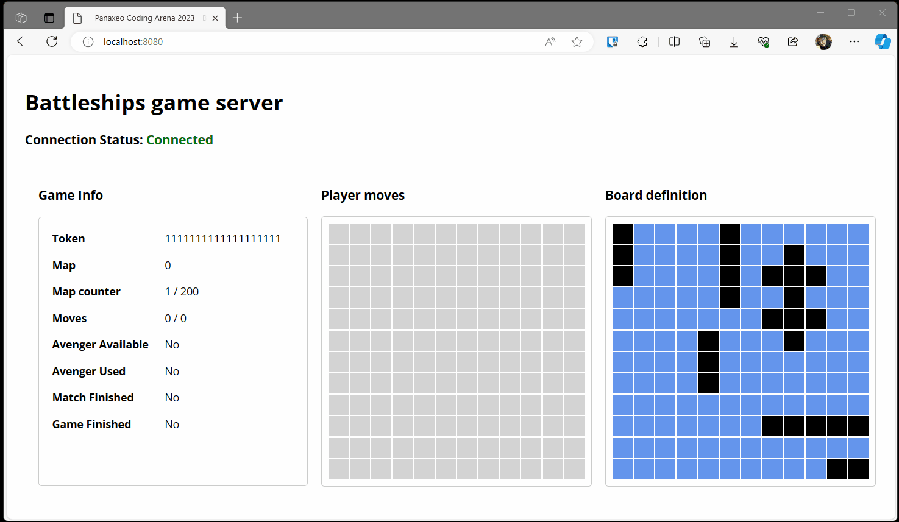

# Panaxeo Coding Arena 2023 - Battleships playground server

# Description
This project aims to provide a playground server for the [Panaxeo Coding Arena](https://www.panaxeo.com/coding-arena) competition.

The project is written in C# and .NET Core 8.0. It is a Web API application that can be run on Windows, Linux, and macOS. Or you can just use `Docker` to run it.
The API provided is the same as prescribed by the game assignment. The only difference is that there is one extra api endpoint that can be used get the *total moves* made by the player.
Combination of `token` and `test` query parameter is used to identify the player session. (you need to sent the same `token` and `test` query parameter) 

```http
GET http://localhost:8080/status/?test=true
Accept: application/json
Authorization: bearer ANY_TOKEN_YOU_WANT
```



**🛑 DISCLAIMER: The repository is provided as is. It is not intended to be used as a reference for best practices or as a reference for how to write good code. If you find any bugs please try to fix them :-)**


## Competition
The description of the competition can be found in [GAME_ASSIGNMENT.md](GAME_ASSIGNMENT.md) or at [Panaxeo Coding Arena](https://www.panaxeo.com/coding-arena) website.

## How to run

### Prerequisites
To run these projects you need to have Docker desktop installed. You can download it from [here](https://www.docker.com/products/docker-desktop).

### Run
After you have Docker desktop installed you can run the project with the following command:

From the root of the repository build the image:
```bash
docker build -t battleships.api .
```

Start the image:
```bash
docker run -p 8080:8080 battleships.api
```

while sending your requests to the API as `Token` you can youse any string you want. The string will be used as unique identifier for your player. 

Example requests:
```http
GET http://localhost:8080/fire/?test=true
Accept: application/json
Authorization: bearer ANY_TOKEN_YOU_WANT

###

GET http://localhost:8080/status/?test=true
Accept: application/json
Authorization: bearer ANY_TOKEN_YOU_WANT

###

GET http://localhost:8080/fire/3/8?test=true
Accept: application/json
Authorization: bearer ANY_TOKEN_YOU_WANT

###

GET http://localhost:8080/fire/3/8/avenger/thor?test=true
Accept: application/json
Authorization: bearer ANY_TOKEN_YOU_WANT

###

GET http://localhost:8080/reset?test=true
Accept: application/json
Authorization: bearer ANY_TOKEN_YOU_WANT
```

Application will be available at http://localhost:8080 for the visualisation and at http://localhost:8080/swagger/index.html for the swagger documentation.

Now you can start the game by sending requests to the API. The API is the same as the one described in the [GAME_ASSIGNMENT.md](GAME_ASSIGNMENT.md) file or at [Panaxeo Coding Arena](https://www.panaxeo.com/coding-arena) website.

